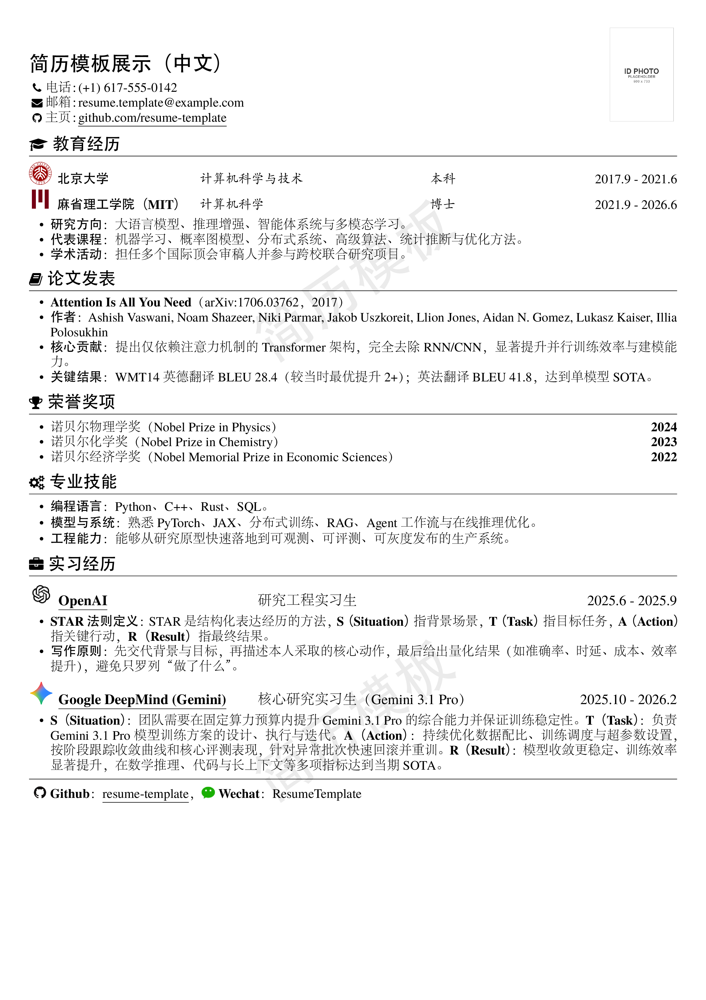

本项目在 [resume](https://github.com/lanxx314/resume) 基础上二次修改。

## 1. 项目说明

一个十分简洁优雅的 **LaTeX** 简历模板, 使用 **XeLaTeX** 或 **PdfLaTex** (只本地支持，如 TeXstudio) 均可编译。

项目修改自 [resume](https://github.com/billryan/resume/)，并进行了优化，若不想本地手动编译可以将该源码打包至 zip 直接上传至 **[OverLeaf](https://www.overleaf.com/)** 等在线平台进行在线编译与预览。

## 2. 模版特性

- 格式布局优雅
- 支持本地编译在线编译
- 容易上手，不会 LaTeX 也能使用
- 可根据需求修改定制和扩展
- 完美的中文支持，包含中文包

## 3. 使用方法
1. 下载项目 zip 包解压缩，或者 git 到本地
2. 配置本地编辑器（TeXstudio）或使用 OverLeaf 等在线平台
3. 打开 resume-template-zh_CN.tex，填充自己的简历内容
4. 编译构建pdf
5. 查看生成的简历文件 resume-template-zh_CN.pdf

注：
[TeXstudio安装与配置指南](https://zhuanlan.zhihu.com/p/675803354)
[OverLeaf注册在线使用指南](https://blog.csdn.net/qq_66536007/article/details/140515188)

## 4. 配置流程（已优化）
目前通用能力已封装到 `resume.cls`，模板文件只保留内容与少量配置。

在 `resume-template-zh_CN.tex` / `resume-template-en_US.tex` 顶部可直接调整：

- `\setstretch{0.93}`：全局行距
- `\renewcommand{\ResumeWatermarkText}{...}`：水印文字
- `\renewcommand{\CompanyIconHeight}{...}`：学校/公司图标尺寸
- `\renewcommand{\OrgTitleWidth}{...}`：公司标题字段宽度
- `\renewcommand{\ContactLabelSep}{...}`：联系方式标签分隔符（中英文可不同）

常用通用宏（均在 `resume.cls` 中）：

- `\edusubsectionwithicon`
- `\orgsubsection`
- `\contactline`
- `\inlineicon`
- `\EnableResumeWatermark`

## 5. 效果输出
简历编译后生成的 PDF 效果如下：

